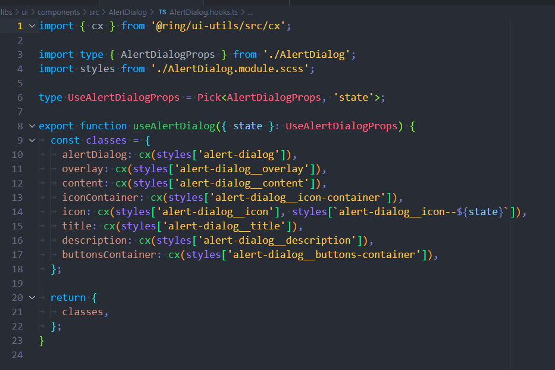
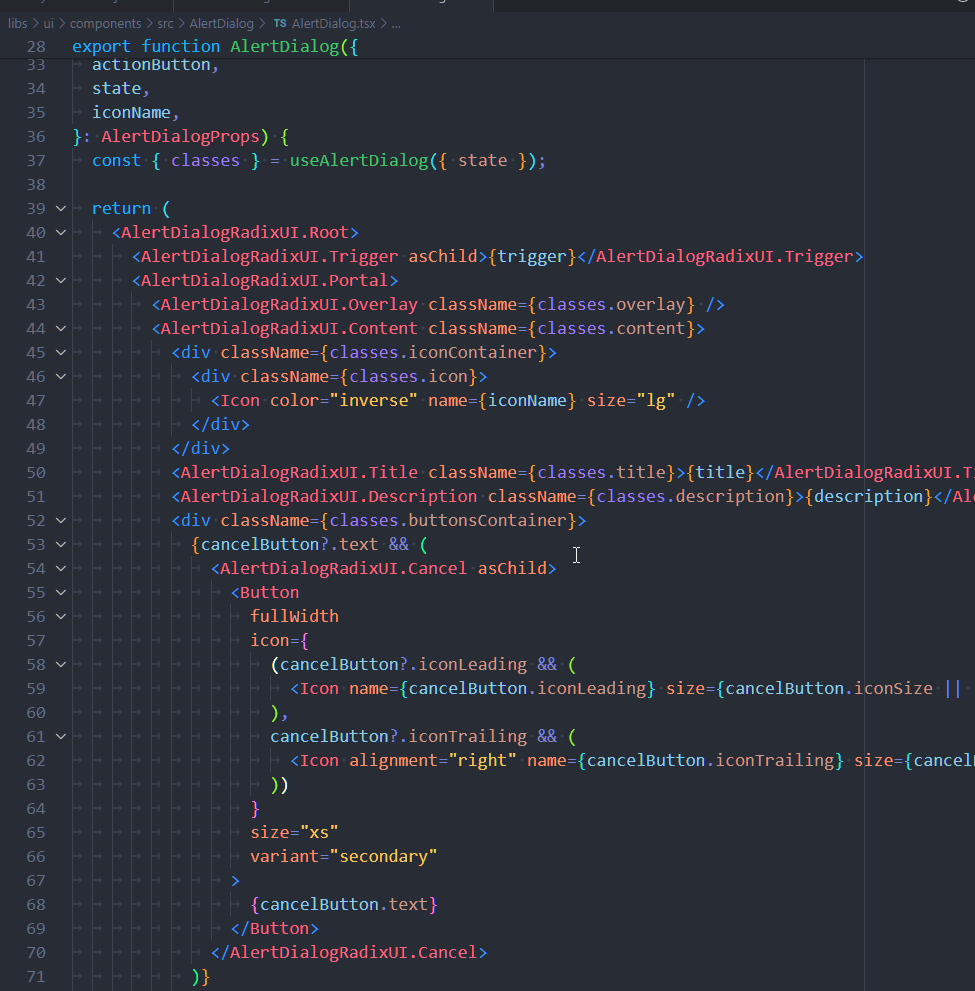
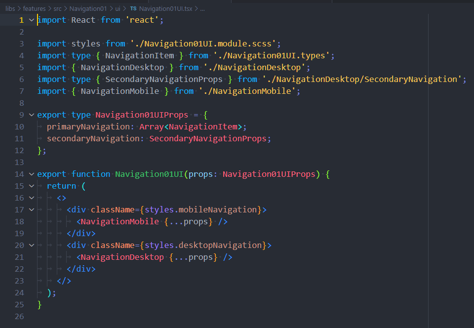

# Classes in components and features

When writing CSS, always use [BEM Naming Conventions](https://getbem.com/). For components, create a classes object in the component's hook and assign classnames imported from the SCSS file. For features, add classnames directly to the feature, so don't use a classes object.

## Components

Create a classes object in the component's hook and assign classnames imported from the SCSS file.

Use imported classnames in markup.

## Features

Import classnames directly from the SCSS file and add them to the markup.

